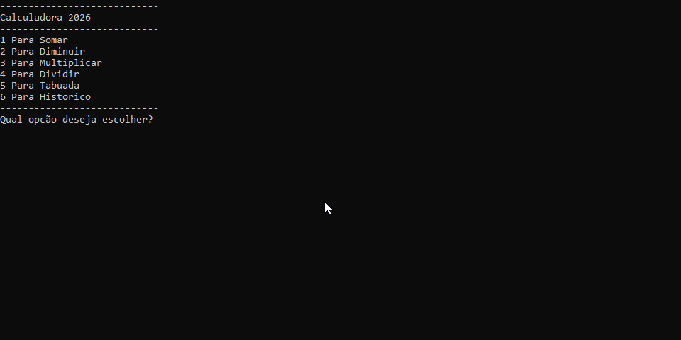

#Calculadora



## Projeto

Desenvolvido Durante o Curso Back-End da [Academia do Programador](https://www.academiadoprogramador.net) 2026


## Introducão

Uma calculadora simples porém poderosa. Ela permite o usuario a realizar as quatro operacões matemáticas, também permite o usuario a ver o histórico de operacões.

## Funcionalidades

**Operacoes Básicas:** Realize adicão, subtracão, multiplicacão, divisão e tabuada.

**Tabuada:** É possivel gerar uma tabuada do 1 ao 10.

**Histórico de Operacões:** A calculadora permite o usuario a verificar o histórico de operacões anteriores.

## Como utilizar o programa

1. Clone ou baixe os arquivos do repositório.
2. Abra o seu emulador do terminal de preferência e navegue até a pasta raiz do projeto baixado.
3. Utilize o comando abaixo para restaurar as depedências do projeto.

```
dotnet restore

```

4. Em seguida compile e execute o projeto com o comando:

```
dotnet run --project Calculadora.Consoleapp
```

## Requisitos

- .NET 10.0 SDK